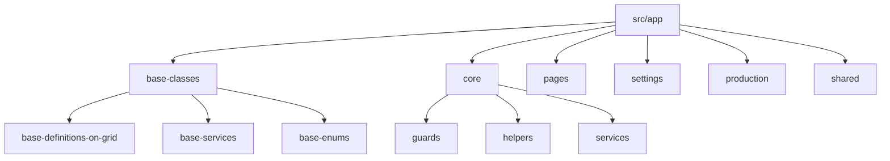

# BOnlineStore Angular & DevExtreme Geliştirme Standartları

Bu kılavuz, **BOnlineStore** istemci uygulamasında (Angular 17+ ve DevExtreme tabanlı) kullanılan mimari yapıyı, kodlama standartlarını, tasarım şablonlarını ve en iyi uygulama kurallarını tanımlar. Yeni geliştirilecek tüm modüller ve bileşenler bu standartlara harfiyen uymalıdır.

---

## 1. Genel Mimari ve Klasör Yapısı

Uygulama, modüler bir Angular mimarisine sahiptir ve sorumlulukların ayrılması (Separation of Concerns) ilkesini benimser. Klasör yapısı ve temel görevleri şu şekildedir:



### Klasör Görev Dağılımı:
*   **`base-classes/`**: Tüm projede ortak kullanılan soyut sınıfları barındırır.
    *   `base-definitions-on-grid/`: DevExtreme DataGrid kullanan listeleme/tanımlama sayfalarının türediği temel bileşen (`BaseDefinitionsOnGridComponent`).
    *   `base-services/`: HTTP ve CRUD veri kaynağı (DataSource) yönetimini yapan soyut servis (`BaseService`).
    *   `base-enums/`: API istek türleri ve controller isimlerini tutan temel numaralandırmalar.
*   **`core/`**: Uygulamanın merkezi altyapısını ve singleton servislerini barındırır.
    *   `guards/`: `auth.guard.ts` gibi rota güvenlik denetleyicileri.
    *   `helpers/`: `JwtInterceptor` ve `ErrorInterceptor` gibi HTTP ara yazılımları.
    *   `services/`: Kimlik doğrulama (`auth.service`), dil/yerelleştirme (`language.service`), zaman dilimi (`timezone.service`), API yönetimi (`rest-api.service`) gibi çekirdek servisler.
*   **`shared/`**: Modüllerden bağımsız, uygulama genelinde tekrar kullanılabilir component, pipe ve direktifleri barındırır.
*   **`pages/`**: Uygulamanın ana ekranlarını (`dashboards` vb.) barındırır.
*   **`production/` & `settings/`**: Belirli iş alanlarına (Business Domains) göre ayrılmış özellik modülleri (Feature Modules). Her özellik modülü kendi içinde component, service, routing ve model alt klasörlerine sahiptir.

---

## 2. İsimlendirme ve Dil Standartları

### Dosya ve Sınıf İsimlendirmeleri
Tüm kod tabanında Angular'ın resmi stil rehberine ve tutarlı dosya eklerine (suffixes) uyulur:

| Tür | Dosya Adı Deseni | Sınıf Adı Deseni | Örnek |
| :--- | :--- | :--- | :--- |
| **Component** | `*.component.ts` | `*Component` | `UserComponent` |
| **Service** | `*.service.ts` | `*Service` | `UserService` |
| **Module** | `*.module.ts` | `*Module` | `UserModule` |
| **Enum** | `*.enum.ts` | `*Enum` | `HttpRequestMethodsEnum` |
| **Interface** | `*-interface.ts` | `I*` | `IFormulaDetail` |
| **Model** | `*-model.ts` | `*` | `Formula` |

### Dil ve Yerelleştirme (i18n)
*   Kullanıcıya gösterilen tüm metinler **`@ngx-translate/core`** kullanılarak yerelleştirilmelidir.
*   Metinler doğrudan HTML içine yazılmaz. Her zaman `translate` pipe'ı veya TS tarafında `TranslateService.instant()` kullanılır.
*   Yerelleştirme anahtarları **BÜYÜK HARFLE** tanımlanır ve hiyerarşik yapıdadır:
    *   *HTML Örneği:* `{{ 'USER_PROFILE.FIRST_NAME' | translate }}`
    *   *TS Örneği:* `this._translate.instant('SAVERECORDERROR')`
*   Dil değişimlerini dinamik olarak yakalamak için component'lerde `.onLangChange` event'ine subscribe olunur.

---

## 3. Servis Tasarımı ve API İletişimi (BaseService)

API ile CRUD işlemlerini yürüten tüm servisler **`BaseService`** sınıfından türetilmelidir. Bu yapı, DevExtreme bileşenleri için gerekli olan `DataSource` ve `CustomStore` adaptasyonunu otomatik olarak sağlar.

### Standart Bir Servis Yapısı
```typescript
import { Injectable } from '@angular/core';
import { HttpClient } from '@angular/common/http';
import DataSource from 'devextreme/data/data_source';
import { environment } from '../../../environments/environment';
import { BaseService } from '../../base-classes/base-services/base-service';
import { SettingsControllerNamesEnum } from '../../base-classes/base-enums/settings-controller-names.enum';

@Injectable({
  providedIn: 'root',
})
export class UserService extends BaseService {
  constructor(public override _http: HttpClient) {
    super(
      _http,
      environment.identityUrl + '/api/', // Servis URL'i
      SettingsControllerNamesEnum.USER   // Controller Adı (Enum)
    );
  }

  // Standart grid veri kaynağı
  getDataSource(): DataSource {
    return super.getBaseDataSource();
  }
}
```

### BaseService Yetenekleri
*   **`getBaseDataSource(...)`**: Sunucu tarafında sayfalama (paging), sıralama (sorting) ve filtreleme (filtering) işlemlerini yöneten, DevExtreme DataGrid uyumlu `DataSource` nesnesini döner.
*   **`getBaseRawCustomStore(...)`**: Özellikle açılır listeler (Combobox/SelectBox) için hafifletilmiş, `raw` modda çalışan flat listeleri çekmek için kullanılan `CustomStore` nesnesini döner.
*   **`sendRequest(...)`**: HTTP metotlarını `HttpRequestMethodsEnum` üzerinden yönlendirir. RxJS Observable'larını `lastValueFrom` ile Promise yapısına çevirir. Backend'den dönen standart cevap şablonundan otomatik olarak `.result` alanını ayıklar.
*   **`httpPostRequest / httpGetRequest`**: Özelleştirilmiş RPC tarzı API istekleri (örneğin: `ExecuteFormulaTest` veya `CopyFormula`) için Promise tabanlı yardımcı metotlardır.

---

## 4. Veri Izgarası (DataGrid) ve Temel Component Yapısı

Listeleme ve tanımlama sayfalarındaki component'ler **`BaseDefinitionsOnGridComponent`** sınıfından türetilmelidir.

### BaseDefinitionsOnGridComponent Sağladığı Özellikler
1.  **Dışa Aktarım (Exporting)**: DevExtreme veri ızgarasındaki verilerin Excel (`exceljs` + `devextreme/excel_exporter`) ve PDF (`jspdf` + `devextreme/pdf_exporter`) formatlarında dışa aktarılmasını otomatik yönetir.
2.  **Breadcrumb (Ekmek Kırıntısı)**: Sayfa içi yönlendirme adımlarını dinamik olarak yerelleştirerek oluşturur.
3.  **Yenileme (Refresh)**: `refreshDataGrid()` metodu ile ızgara veri kaynağını tetikler.

### Standart Bir Component Sınıf Tasarımı
```typescript
@Component({
  selector: 'user',
  templateUrl: './user.component.html',
  styleUrls: ['./user.component.scss'],
})
export class UserComponent extends BaseDefinitionsOnGridComponent implements OnInit {
  public userDataSource: DataSource;

  constructor(
    public override _translate: TranslateService,
    private _userService: UserService
  ) {
    super(
      _translate,
      'USER',      // Dışa aktarılacak dosya adı
      'USER',      // Breadcrumb component key'i
      'SETTINGS'   // Breadcrumb parent key'i
    );
    this.userDataSource = _userService.getDataSource();

    // DevExtreme buton event context'ini korumak için bind işlemi zorunludur
    this.editRecord = this.editRecord.bind(this);
  }

  ngOnInit(): void {
    // İlk kurulumlar ve dile duyarlı seçenekler burada ayarlanır
  }

  editRecord(e: any) {
    // Düzenleme mantığı
    e.event.preventDefault();
  }
}
```

> [!IMPORTANT]
> DevExtreme DataGrid üzerindeki özel butonların `[onClick]` eventlerine atanan metotlar, `this` bağlamını (context) kaybetmemek için mutlaka constructor içinde `.bind(this)` ile sınıf nesnesine bağlanmalıdır.

---

## 5. UI Standartları ve Kullanıcı Deneyimi (UX)

### Veri Giriş Formları ve Popup Kullanımı
*   Ekleme ve Güncelleme işlemleri için DevExtreme popup modu (`<dxo-editing mode="popup">`) veya ana sayfayı gizleyip detay formunu gösteren iki durumlu (`*ngIf="!formActive"` ve `*ngIf="formActive"`) tasarımlar tercih edilir.
*   DataGrid içinde görünmeyen ancak formda doldurulması gereken kolonlar `[visible]="false"` olarak tanımlanır. Bu kolonlar form açıldığında otomatik olarak render edilir.

### Benzersiz ID (PK) Üretimi
*   Yeni kayıt oluşturulurken primary key (ID) ataması istemci tarafında **BSON ObjectId** standardı kullanılarak yapılır.
*   Bu sayede kaydetme işleminden önce istemci tarafında ilişkili alt nesneler oluşturulabilir.
    ```typescript
    import { ObjectId } from 'bson';
    
    newFormula(e) {
      const objectId = new ObjectId();
      this.formula = new Formula(objectId.toString()); // Benzersiz ID istemcide üretilir
      this.formCrudType = FormCrudTypeEnum.INSERT;
      this.formActive = true;
    }
    ```

### Doğrulama (Validation) Kuralları
Form alanlarında tutarlılığı sağlamak amacıyla DevExtreme doğrulama bileşenleri kullanılır:
*   Zorunlu Alanlar: `<dxi-validation-rule type="required"></dxi-validation-rule>`
*   Uzunluk Sınırları: `type="stringLength" [max]="250"`
*   Özel Mantıksal Denetimler: `type="custom" [validationCallback]="validateMethod"` (örneğin: şifre karmaşıklık kontrolü veya iki şifre alanının uyuşması).

### Bildirimler ve Uyarı Mesajları (SweetAlert2)
Kullanıcıya gösterilecek onay, başarı ve hata mesajlarında tarayıcının varsayılan popupları yerine **SweetAlert2 (Swal)** kütüphanesi kullanılır. Temel parametre standartları:
*   Onay buton rengi: `#364574` (Projenin ana kurumsal lacivert tonu)
*   Hata ve başarı popup'ları z-index çakışmalarını önlemek için `swal2-custom-zindex` sınıfı ile desteklenir.

```typescript
Swal.fire({
  title: this._translate.instant('WARNING'),
  text: this._translate.instant('FORMULDELETECONFIRMATIONMESSAGE'),
  icon: 'warning',
  showCancelButton: true,
  confirmButtonColor: '#364574',
  cancelButtonColor: '#364574',
  confirmButtonText: this._translate.instant('OK'),
  cancelButtonText: this._translate.instant('CANCEL')
});
```

---

## 6. Performans ve Güvenlik Standartları

*   **Remote Operations**: Grid'lerde büyük veri kümeleri ile çalışırken performansı korumak için `[remoteOperations]="true"` seti zorunludur. Arama, sıralama ve sayfalama sunucu tarafında yapılmalıdır.
*   **Virtual Scrolling**: Satır sayısı yüksek olan listelerde render performansını artırmak için sanal kaydırma aktifleştirilir: `<dxo-scrolling rowRenderingMode="virtual"></dxo-scrolling>`.
*   **Repaint Changes Only**: Grid güncellemelerinde tüm bileşenin yeniden çizilmesini engellemek için `[repaintChangesOnly]="true"` kullanılır.
*   **Güvenlik Ara Yazılımları**: 
    *   `JwtInterceptor`: Her API isteğine otomatik olarak JWT token'ını ekler.
    *   `ErrorInterceptor`: HTTP 401 (Unauthorized) veya 403 (Forbidden) hataları aldığında kullanıcı oturumunu sonlandırır ve giriş sayfasına yönlendirir.

---

Bu standartlar, **BOnlineStore** uygulamasının sürdürülebilir, yüksek performanslı ve tutarlı bir şekilde büyümesini garanti eder. Geliştirme yaparken bu yetenek dosyası referans alınmalıdır.
