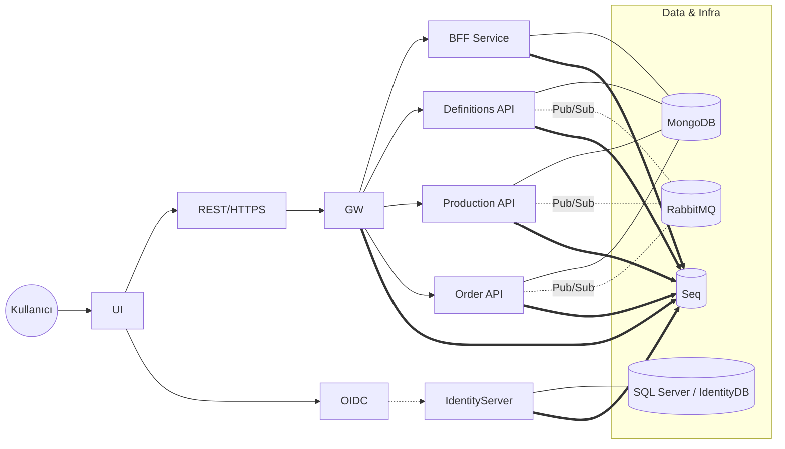

# BOnlineStore — Mikroservis E-Ticaret Platformu

BOnlineStore, .NET 8, Angular ve bulut-yerel teknolojilerle geliştirilmiş, kimlik yönetimi (IdentityServer), API Gateway (Ocelot), BFF ve alan servislerinden (Definitions, Production, Order) oluşan bir mikroservis projesidir. Altyapıda MongoDB, SQL Server, RabbitMQ ve log/observability için Seq kullanılır. Yerel geliştirici deneyimi için Docker Compose; üretim için Kubernetes manifestleri (Rancher uyumlu) sağlanır.

> Not: Bu döküman, Windows/PowerShell akışını esas alır; komutlar PowerShell için verilmiştir.

---

## Mimarinin özeti

- UI (Angular) → API Gateway (Ocelot) → BFF/Domain Servisleri (Definitions, Production, Order)
- Kimlik Doğrulama: IdentityServer (OpenID Connect & OAuth2) → JWT doğrulama
- Veri: MongoDB (servisler), SQL Server (IdentityDB)
- Mesajlaşma: RabbitMQ
- Loglama/Observability: Serilog → Seq

### Servisler arası akış (Mermaid)



---

## Teknoloji yığını

- Backend: .NET 8, ASP.NET Core, Ocelot (Gateway), IdentityServer
- Frontend: Angular (UI `ClientApp`)
- Veri/Mesajlaşma: MongoDB, SQL Server (IdentityDB), RabbitMQ
- Loglama/Observability: Serilog, Seq
- Konteyner/Dağıtım: Docker, Docker Compose, Kubernetes (Rancher uyumlu), Ingress
- CI/CD: Bitbucket Pipelines → Docker Hub image’ları

---

## Dizim yapısı (özet)

- `BOnlineStore.Gateway/`: Ocelot tabanlı API Gateway (+ `configuration.*.json`)
- `BOnlineStore.IdentityServer/`: Kimlik yönetimi (IdentityServer), SQL Server’a bağlı
- `BOnlineStore.Services/`: Domain servisleri
  - `BFF/`, `Definitions/`, `Production/`, `Order/`
- `BOnlineStore.UI/`: UI host projesi, Angular kaynakları `ClientApp/` altında
- `Shared/`: Ortak kütüphaneler, sertifikalar (`Shared/Certificates/*`)
- `docker-compose.yml` + `docker-compose.override.yml`: Yerel çoklu konteyner çalıştırma
- `Kubernetes/`: Servis başına `deployment.yaml`, `config-map.yaml` (bazılarında `secret.yaml`, PV/PVC)
- `bitbucket-pipelines.yml`: CI/CD tanımı (build/test/push)

---

## Hızlı başlangıç (yerel)

### Önkoşullar

- Windows 10/11 + PowerShell 5.1+
- Docker Desktop (WSL 2 önerilir)
- .NET SDK 8.0+
- Node.js 18.x veya 20.x (Angular için, UI yerel çalıştırmada gerekir)

### Seçenek A — Docker Compose ile (önerilen en kolay)

1. (İsteğe bağlı) `hosts` dosyası eşlemesi
   Bazı konteyner içi ayarlar domain isimleri kullanır. Yerelde tarayıcıdan erişim için aşağıdaki host adlarını `127.0.0.1`’e eşleyebilirsiniz:

   - `identity.b-online-store.com`
   - `gateway.b-online-store.com`
   - `ui.b-online-store.com`
   - `definitions.b-online-store.com`
   - `production.b-online-store.com`
   - `order.b-online-store.com`
   - `bff.b-online-store.com`

   Windows yolu: `C:\Windows\System32\drivers\etc\hosts`

   Örnek satırlar:

   ```
   127.0.0.1 identity.b-online-store.com
   127.0.0.1 gateway.b-online-store.com
   127.0.0.1 ui.b-online-store.com
   127.0.0.1 definitions.b-online-store.com
   127.0.0.1 production.b-online-store.com
   127.0.0.1 order.b-online-store.com
   127.0.0.1 bff.b-online-store.com
   ```

2. (Güçlü parola ile) `.env` oluşturun

   - `cp .env.example .env` (Windows PowerShell için aşağıda komut var)
   - Parolaları değiştirin. Compose dosyaları şimdilik sabit değerler içeriyor; `.env`’i referans alacak şekilde özelleştirmek isterseniz compose dosyalarında değişken genişletme kullanabilirsiniz.

3. Boşta portlar kontrolü

   - UI konteyneri host üzerinde `80` ve `443` portlarını açar; çakışma varsa bu portları `docker-compose.override.yml` içinde değiştirin.
   - Diğer önemli portlar: `1444` (SQL), `27017` (Mongo), `15672` (RabbitMQ UI), `5672` (AMQP), `5341` (Seq UI).

4. Konteynerleri başlatın

```powershell
# Proje kökünde
Copy-Item .env.example .env -Force

# Docker Compose up (detached)
docker compose up -d

# Durum kontrolü
docker compose ps
```

5. Erişim URL’leri (varsayılan)

- UI: http://localhost/ veya https://localhost/
- Seq: http://localhost:5341 (ilk girişte lisans/EULA onayı istenir)
- RabbitMQ UI: http://localhost:15672
- Mongo: mongodb://localhost:27017
- SQL Server: localhost,1444

Notlar:

- Gateway ve diğer servisler konteyner ağı içinde 80/443 dinler; dış dünyaya port map edilmemiştir. UI → Gateway/servislere iç DNS ile erişir. Tarayıcıdan doğrudan Gateway’i çağırmanız gerekmez.
- Gateway docker modunda TLS için `bonlinestore.pfx` kullanır (imaj içinde), UI tarafında tarayıcı uyarıları görebilirsiniz. Gerekirse http ile başlayın.

### Seçenek B — Servisleri yerel process olarak çalıştırma (debug)

1. Altyapıyı Docker ile açın (Mongo, SQL, RabbitMQ, Seq)

```powershell
# Yalnızca alt servisleri başlatmak isterseniz
# (docker-compose.override.yml servis bloklarını yorumlayarak özelleştirebilirsiniz)
docker compose up -d mongodb identitydbdocker rabbitmq seq
```

2. Backend servisleri

```powershell
# Restore ve build
 dotnet restore .\BOnlineStore.sln
 dotnet build .\BOnlineStore.sln -c Debug

# IdentityServer (https://localhost:5001)
 dotnet run --project .\BOnlineStore.IdentityServer\BOnlineStore.IdentityServer.csproj

# API Gateway (configuration.local.json okunur)
 dotnet run --project .\BOnlineStore.Gateway\BOnlineStore.Gateway.csproj

# Domain servisleri (ihtiyaca göre ayrı terminallerde)
 dotnet run --project .\BOnlineStore.Services\Definitions\BOnlineStore.Services.Definitions.Api\BOnlineStore.Services.Definitions.Api.csproj
 dotnet run --project .\BOnlineStore.Services\Production\BOnlineStore.Services.Production.Api\BOnlineStore.Services.Production.Api.csproj
 dotnet run --project .\BOnlineStore.Services\Order\BOnlineStore.Services.Order.Api\BOnlineStore.Services.Order.Api.csproj

# BFF
 dotnet run --project .\BOnlineStore.Services\BFF\BOnlineStore.BFF\BOnlineStore.BFF.csproj
```

3. UI (Angular CLI)

```powershell
cd .\BOnlineStore.UI\ClientApp
npm ci
npm start
# varsayılan: http://localhost:4200
```

İpuçları:

- Yerel modda `appsettings.Development.json` ve `GatewayRunningMode=local` (Gateway) varsayılanları uygundur; IdentityServerUrl genellikle `https://localhost:5001`.
- IdentityServer varsayılan seed işlemi uygulama açılışında çalışır (Program.cs → SeedData.EnsureSeedData).

---

## Konfigürasyon

- Gateway
  - `BOnlineStore.Gateway/appsettings.json`
    - `IdentityServerUrl`: JWT doğrulama authority
    - `GatewayRunningMode`: `local` veya `docker` (Ocelot config dosya seçimi + Kestrel TLS yapılandırması)
  - `configuration.local.json`, `configuration.docker.json`: Ocelot route tanımları
- IdentityServer
  - `BOnlineStore.IdentityServer/appsettings.json`
    - `ConnectionStrings:DefaultConnection`: SQL Server bağlantısı (yerel: `localhost,1444`)
    - `IdentityConfigSettings:*`: RedirectUri, CORS origin’ler, post-logout vb.
- UI
  - `BOnlineStore.UI/appsettings*.json` ve Angular ortam dosyaları (ClientApp)
- Ortam değişkenleri (Docker/K8s) ile `appsettings` değerleri override edilebilir.

Güvenlik notu: Parolaları/secret’ları commit etmeyin. K8s Secret, CI değişkenleri veya `.env` ile dışarıda yönetin.

---

## Docker görüntüleri ve servis matrisi

- Gateway: `scakir1978/gateway.bonlinestore.com`
- IdentityServer: `scakir1978/identityserver.bonlinestore.com`
- BFF: `scakir1978/bff.bonlinestore.com`
- Definitions: `scakir1978/definitions.bonlinestore.com`
- Production: `scakir1978/production.bonlinestore.com`
- Order: `scakir1978/order.bonlinestore.com`
- UI: `scakir1978/ui.bonlinestore.com`
- Altyapı: `mongo`, `mcr.microsoft.com/mssql/server`, `rabbitmq:3.11-management`, `datalust/seq`

Tag stratejisi:

- `latest` + commit-id; develop için `dev-<commit>`, prod için `prod-<commit>` (Pipelines’ta tanımlı)

---

## Kubernetes’e dağıtım (özet)

Önkoşullar: `kubectl`, bir Kubernetes kümesi (Rancher uyumlu), storage class (Mongo için PV/PVC), Docker Hub pull yetkisi.

Önerilen sıra:

```powershell
# Namespace kullanıyorsanız -n <ns> ekleyin
kubectl apply -f .\Kubernetes\mongodb\

kubectl apply -f .\Kubernetes\identitydb\  # varsa
kubectl apply -f .\Kubernetes\identity\
kubectl apply -f .\Kubernetes\definitions\
kubectl apply -f .\Kubernetes\production\
kubectl apply -f .\Kubernetes\bff\
kubectl apply -f .\Kubernetes\gateway\
kubectl apply -f .\Kubernetes\ui\

# Ingress/routing
kubectl apply -f .\Kubernetes\routing-ingress\

# Seq, RabbitMQ vb. (varsa ilgili klasörlerden)
kubectl apply -f .\Kubernetes\seq\
```

Notlar:

- `secret.yaml` gereken klasörlerde Docker Hub pull secret’ı ve uygulama secret’larını doldurun.
- `config-map.yaml` ile servis URL’lerini ortamınıza göre ayarlayın.
- Ingress host adlarını DNS/Cloudflare ile eşleyin.

---

## CI/CD — Bitbucket Pipelines

- Branch’lere göre paralel adımlar: Definitions, Production, BFF, UI, IdentityServer
- Testler (`dotnet test`) ilgili projeler için koşturulur (IdentityServer, Definitions)
- Docker Hub’a login + build + tag + push (latest ve commit tag’ları; develop için `dev-*`)
- Ortam değişkenleri (Deployment Variables): `DOCKERHUB_USERNAME`, `DOCKERHUB_PASSWORD`
- Önbellekler: Docker cache, .NET NuGet cache, Node cache

Pipeline kesitleri için: `bitbucket-pipelines.yml`

---

## Veritabanı ve veri başlatma

- MongoDB: `init-mongo.js` örnek dosyaları repo kökünde/misc; Compose ve K8s’de persistent volume kullanılır (klasörlerde PV/PVC mevcut).
- IdentityDB: IdentityServer `SeedData.EnsureSeedData()` ile başlangıç verisi/şeması yaratır (kendi gereksinimlerinize göre güncelleyin).

---

## Loglama ve izleme

- Serilog konfigürasyonları `appsettings.json` üzerinden
- Seq: http://localhost:5341 — konteyner loglarını ve uygulama loglarını izleyin

---

## Testler

```powershell
# Çekirdek testler
 dotnet test .\BOnlineStore.UnitTests\BOnlineStore.IdentityServer.UnitTests\BOnlineStore.IdentityServer.UnitTests.csproj
 dotnet test .\BOnlineStore.UnitTests\BOnlineStore.Services.Definitions.Api.UnitTests\BOnlineStore.Services.Definitions.Api.UnitTests.csproj
```

---

## Sorun giderme

- Port çakışmaları: `80/443/1444/27017/15672/5672/5341` kullanan süreçleri sonlandırın veya compose portlarını değiştirin.
- Node bellek hataları (UI build): Pipelines’ta `NODE_OPTIONS=--max_old_space_size=3072` kullanılıyor; yerelde de gerekebilir.
- CORS/Authority: `IdentityServerUrl` ve UI origin’lerinin eşleştiğini doğrulayın (IdentityConfigSettings).
- Sertifika uyarıları: Yerelde self-signed sertifika uyarıları normaldir; http ile test edebilirsiniz.
- Docker DNS/host adları: Yerelde `hosts` eşlemesi yapın veya doğrudan `localhost` ile başlayın.

---

## Güvenlik notları

- Parolaları/secret’ları `.env`, K8s Secrets veya CI değişkenleriyle yönetin; koda gömmeyin.
- SQL için `TrustServerCertificate=true` yalnızca yerel/geliştirme içindir.
- Sertifika/anahtar dosyalarını (PFX/CRT) güvenli yönetin.

---

## Sürümleme ve branch stratejisi

- Branch’lar: `main` (prod), `develop` (geliştirme), feature branch’lar
- Image tag’leri: `latest`, commit SHA, `dev-*`, `prod-*`, `staging-*`

---

## Lisans ve katkı

- Lisans: `LICENSE`
- Katkı: PR’larda testlerin geçmesi ve Docker görüntülerinin build edilebilir olması beklenir.

---

## Yazarlar/iletişim

- Repo sahibi: `scakir1978`
- İletişim/issue: Lütfen repository issue’larını kullanın.

---

### Ek: Hızlı komut başvurusu (PowerShell)

```powershell
# Compose başlatma
 docker compose up -d
# Compose durdurma
 docker compose down
# Logları izleme
 docker compose logs -f --tail=200
# Tek servis yeniden başlatma (örnek: gateway)
 docker compose up -d --build gateway.bonlinestore.com
```

---

Bu README, repo içeriği taranarak (Docker/K8s manifestleri, appsettings, Program.cs’ler, Pipelines) üretilmiştir. Ortamınıza göre host adları, portlar ve secret değerlerini güncellemeniz gerekebilir.
